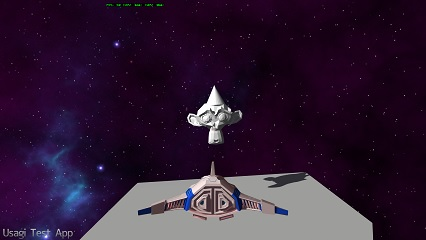

UsagiTest
=========

A test application for the Usagi engine.  
Meant to show the correct usage rather than act as a demonstration of the features.  
Work is *not* being done on this project internally. It is only periodically updated to a (very basic) working state for version number increases because there is nothing more complex that can be made publically available at this time.  

Getting up and running
----------------------

1. Clone this repository recursively (under advanced options in sourcetree or specify --recursive at the command line)

1. Follow the instructions in the Usagi [README.md](https://github.com/vitei/Usagi/blob/master/README.md)

1. Run 'rake projects' from the command line  
   or  
   Open UsagiTest.sln and right-click ProjectGenerator and select build  
   This must currently be done per configuration

1. Set Usagi test as the startup project  
   Right click 'Set as start-up project'
   
1. Build and run
